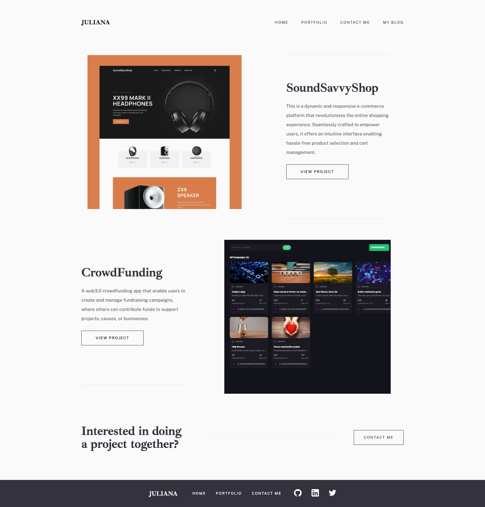

# My Portfolio

> My portfolio Website.

This project entails Building a mobile and desktop version of my portfolio website which displays my skills, recent projects that I have worked on, the technologies I use, about me and the contact form. 

You can get in touch with me by sending a message through the contact form and be rest assured that I receive your message and will reply within 2 days of receiving your message. Thank you!

## Built With

- Html
- Css
- JavaScript
- React
- SASS

### Prerequisites

- Text editor
- Git
- Github

## Live Demo

[Live Demo Link](https://julianaifionu.com/)

## Getting Started

To get a local copy up and running follow these simple steps.

- You can clone this repo by typing `git clone git@github.com:julie-ify/portfolio-website.git` on your terminal
- Type `cd portfolio-website` and open the project in your favorite text editor
- Run `npm i` & `npm start`

## Author

👤 **Juliana Ifionu**

- GitHub: [juliana-Ifionu](https://github.com/julie-ify)
- LinkedIn: [Juliana Ifionu](https://www.linkedin.com/in/julianaifionu/)
- Twitter: [Juliana Ifionu](https://twitter.com/juliana_ifionu)

## 🤝 Contributing

Contributions, issues, and feature requests are welcome!

Feel free to check the [issues page](https://github.com/julie-ify/portfolio-website/issues).

## Show your support

Give a ⭐️ if you like this project!

## 📝 License

This project is [MIT](./MIT.md) licensed.

## Acknowledgments

Frontend Mentor Figma design by [Minimalist portfolio website challenge on Frontend Mentor](https://www.frontendmentor.io/challenges/minimalist-portfolio-website-LMy-ZRyiE)